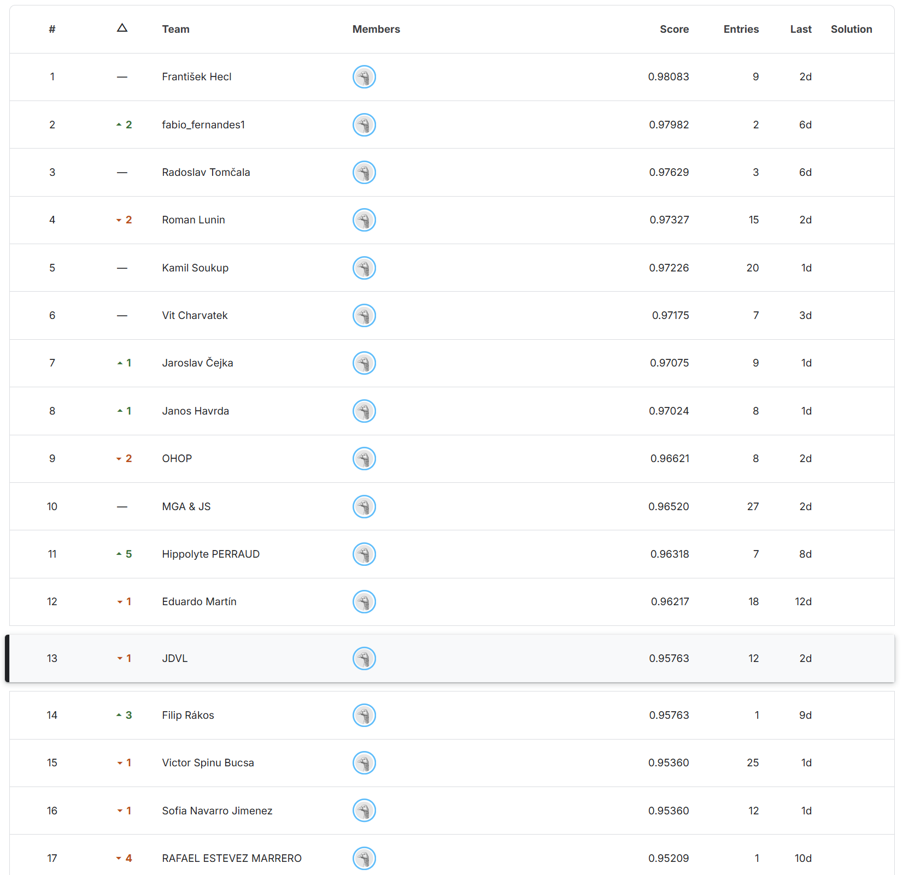
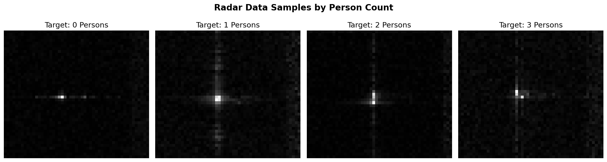
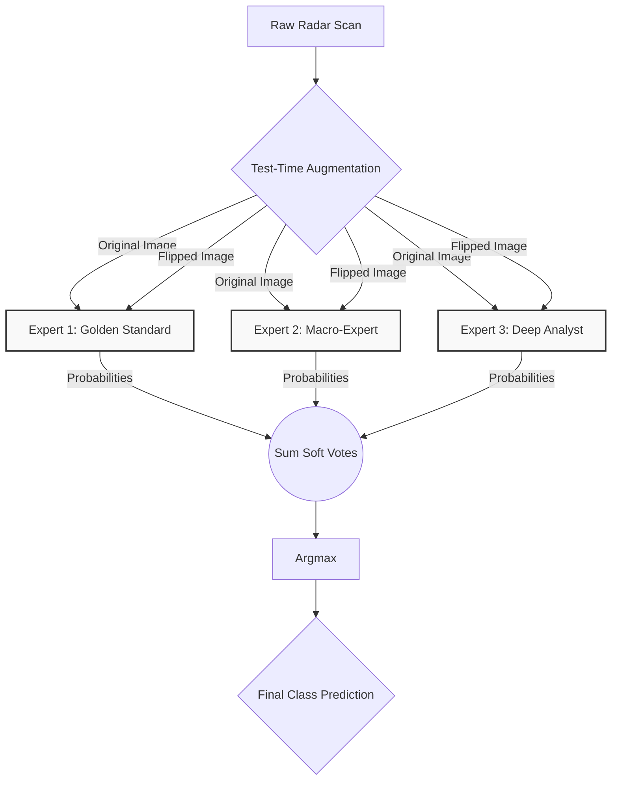
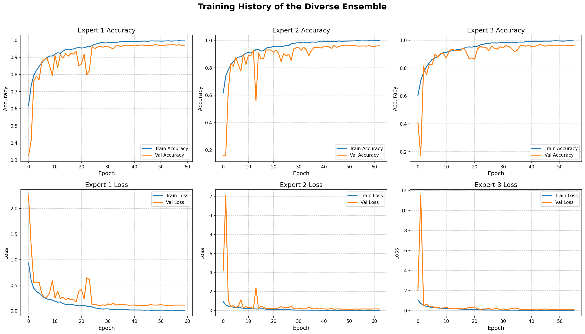
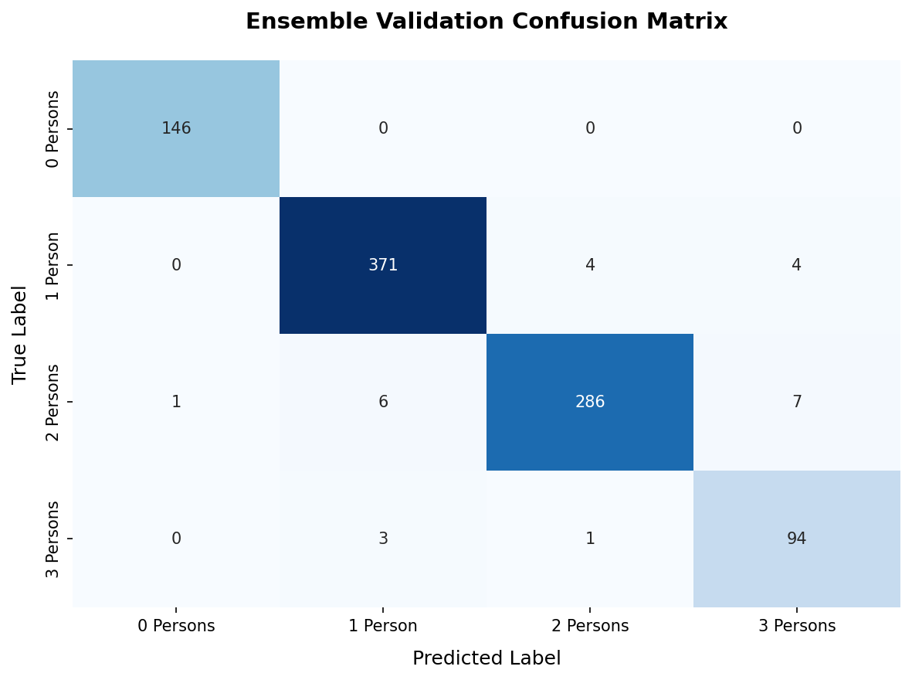

# Room Occupancy Detection and Counting from Radar Data

This repository contains the final solution for a machine learning competition project developed for the Machine Learning (MLF) course. The primary objective was to design a robust computer vision model capable of estimating the exact number of people (0, 1, 2, or 3) present in a room based solely on 2D radar scans.

With this solution, we achieved an accuracy of **~95.76%**, securing a 13th place on the Kaggle Leaderboard.

## Data Pipeline and Preprocessing
The dataset consists of raw 2D radar heatmaps representing spatial reflections. To ensure the models learned true physical features rather than noise, we implemented a strict preprocessing pipeline:

* **Grayscale Conversion:** Images were processed in single-channel format to focus purely on signal intensity.
* **Physical Zero Preservation:** Pixel values were Min-Max scaled by dividing by `255.0`, mapping the data to a `[0, 1]` range while keeping absolute darkness (empty space) strictly at 0.
* **Label Synchronization:** We developed a custom loading script to resolve a known offset anomaly in the dataset, correctly pairing CSV labels with their respective images using a programmatic `+1` index shift.

Below is a sample of the preprocessed radar data, demonstrating the visual patterns the network learned to distinguish for different room occupancies:

## Architecture: The Diverse Ensemble
To maximize generalization, we discarded the single-model approach in favor of a Diverse Ensemble strategy. We trained three distinct Convolutional Neural Network (CNN) architectures, each designed to evaluate the radar data differently:

1. **The Golden Standard (Base Expert):** Utilizes standard 3x3 convolutional filters and a 256-neuron Dense layer. Highly effective at recognizing standard human reflection signatures.
2. **The Macro-Expert (Spatial Expert):** Replaces the initial layers with larger 5x5 filters. This increases the receptive field early in the network, allowing it to detect broader spatial anomalies and scattered clusters.
3. **The Deep Analyst (Deep Expert):** Uses 3x3 filters but features a massively expanded fully connected block (512 neurons) combined with aggressive Dropout (0.6) for more complex decision logic.

## Training Methodology
Preventing overfitting on the radar noise was our primary challenge. We utilized the following techniques during the training phase:

* **Balanced Class Weights:** Misclassifying underrepresented classes resulted in a higher error penalty, forcing the network to learn all classes equally.
* **Dynamic Learning Rate:** Implemented `ReduceLROnPlateau` to halve the learning rate if the validation loss stagnated, allowing the optimizer to settle into narrower local minima.
* **Time-Machine Early Stopping:** We utilized the `restore_best_weights=True` callback to automatically revert the network to the exact epoch where it achieved its absolute lowest validation loss.

## Inference Strategy: Test-Time Augmentation (TTA)
Our submission pipeline employs Test-Time Augmentation combined with Soft Voting to achieve maximum robustness on unseen Kaggle test data. For every single test image, we generate a second, horizontally flipped version. 

The 3 expert models predict probabilities for both the original and the flipped image. The 6 resulting probability vectors (3 models x 2 views) are summed together. The final class prediction is determined by the `argmax` of these combined probabilities.

## Results and Evaluation
The ensemble demonstrates exceptional stability across all classes. Below is the Validation Confusion Matrix, which visualizes the ensemble's performance on the 10% hold-out data.

**Key Observations:**
* **Empty Room (0 Persons):** Near-perfect classification. The physical zero baseline successfully prevents false positives.
* **1 Person:** Extremely high recall. Single reflection clusters are easily isolated by the CNNs.
* **2 vs. 3 Persons:** The highest rate of ambiguity occurs when multiple people overlap in the radar's line of sight. The spatial 5x5 filter expert specifically helps mitigate this issue.

## Authors
* **Team JDVL**
